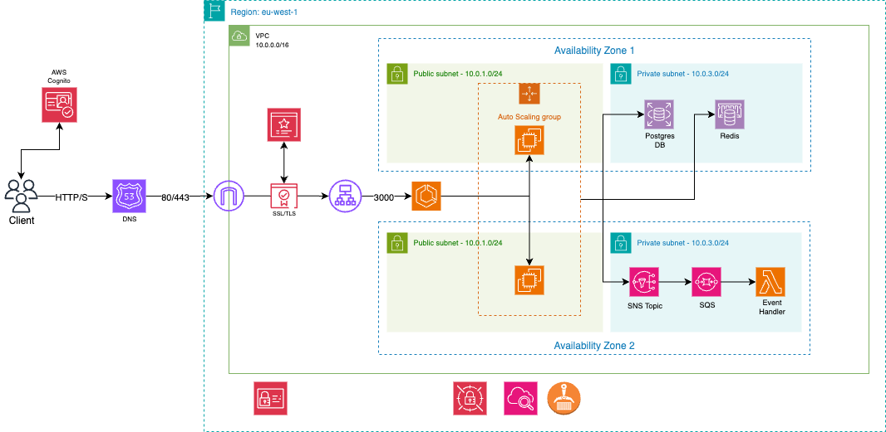

<a id="readme-top"></a>

<!-- PROJECT LOGO & ARCHITECTURE DIAGRAM -->
<br />
<div align="center">
  
  <h3 align="center">Mirama Infrastructure (IaC)</h3>
  <p align="center">
    
    
    <br />
    <strong>Infrastructure Docs</strong>
    <br />
    <a href="https://github.com/YannickUllisch/mirama-app">Mirama-App</a>
    &middot;
    <a href="https://www.linkedin.com/in/yannickullisch/">LinkedIn</a>
    &middot;
    <a href="mailto:yannicku01@gmail.com">Contact</a>
  </p>
  <br />
  
</div>

<br />
<br />

<!-- TABLE OF CONTENTS -->

<details>
  <summary>Table of Contents</summary>
  <ol>
    <li><a href="#about-the-project">About The Project</a></li>
    <li><a href="#component-descriptions">Component Descriptions</a></li>
    <li><a href="#getting-started">Getting Started</a></li>
    <li><a href="#roadmap">Roadmap</a></li>
    <li><a href="#license">License</a></li>
    <li><a href="#acknowledgments">Acknowledgments</a></li>
  </ol>
</details>


<!-- ABOUT THE PROJECT -->

## About The Project

This repository contains the complete **Infrastructure as Code (IaC)** for the Mirama platform, an event-driven application leveraging AWS cloud services. All resources are provisioned and managed using [Terraform](https://www.terraform.io/), following best practices for modularity, security, and scalability.

The architecture (see diagram above) is designed for high availability, scalability, and secure communication between services using AWS managed services, while remaining in the AWS Free Tier. 


<!-- USAGE EXAMPLES -->

## Component Descriptions

This repository provisions the **core AWS infrastructure** for Mirama, including:

- **VPC & Networking**: Secure, isolated networking with both public and private subnets, leveraging multiple availability zones for high availability. To optimize for the AWS Free Tier, NAT Gateways are omitted as they incur quite significant costs, so only public subnets are used for compute resources. All routing and subnetting is managed for scalability and future private subnet expansion.
- **IAM**: Fine-grained roles and policies for ECS, Lambda, and other services, following the principle of least privilege. All compute and service roles are tightly scoped to only the permissions required, improving security and auditability.
- **ECS (Elastic Container Service)**: Cluster and services for running the Mirama Next.js App. The Auto Scaling Group (ASG) is restricted to a single EC2 instance to remain within Free Tier limits. EC2 instances are placed in public subnets (due to the lack of NAT Gateways), and ECS is configured to use self-managed EC2 instances instead of Fargate for cost reasons. Security Groups are tightly restricted to only allow necessary inbound/outbound traffic (e.g., HTTP/HTTPS from the ALB, and only required ports for the app), minimizing the attack surface.
- **RDS**: Managed PostgreSQL database for persistent storage, deployed in private subnets for optimal security. Security Groups are configured to only allow traffic from within the VPC or specific application resources, and not from the public internet. All credentials are generated securely.
- **Cognito**: User authentication and identity management, including support for federated identity providers (Google). User pools and domains are parameterized for environment-specific deployments, and sensitive OAuth credentials are managed securely.
- **SNS & SQS**: Event-driven messaging backbone for microservice communication, enabling scalable, decoupled service interactions. Topics and queues are provisioned with environment isolation and can be further restricted by IAM policies for secure publishing/consuming.
- **Repository (ECR)**: Container registry for application images, with a strict lifecycle policy to automatically remove untagged images and minimize storage costs. Access is restricted to only the necessary build and deployment roles.
- **Secrets Manager**: Secure storage for sensitive configuration, such as database credentials and API keys. Secrets are never stored in plaintext in the codebase or state files, and access is tightly controlled via IAM. We currently do not have the Secrets Manager being actively used.

Each module is reusable and can be managed independently. See the `env/prod/` directory for environment-specific configuration.

<br />


<!-- GETTING STARTED -->

## Getting Started

To provision the Mirama infrastructure, you need to have [Terraform](https://www.terraform.io/downloads.html) and [AWS CLI](https://aws.amazon.com/cli/) installed and configured with appropriate credentials.

### Prerequisites

* [Terraform >= 1.0](https://www.terraform.io/downloads.html)
* [AWS CLI](https://aws.amazon.com/cli/)
* AWS account with sufficient permissions

### Installation & Usage

1. **Clone the repository**
   ```sh
   git clone https://github.com/YannickUllisch/mirama-infra.git
   cd mirama-infra
   ```
2. **Initialize Terraform**
   ```sh
   terraform -chdir=env/prod/<module> init
   ```
   Replace `<module>` with the desired environment module (e.g., `network`, `ecs`, etc.).
3. **Plan and Apply**
   ```sh
   terraform -chdir=env/prod/<module> plan
   terraform -chdir=env/prod/<module> apply
   ```
   Repeat for each module as needed, following dependencies (e.g., network before ECS).

<!-- ROADMAP -->

## Roadmap

- [x] Modularize all core AWS resources
- [x] Add event-driven messaging backbone
- [x] Secure authentication with Cognito
- [ ] Add monitoring/observability modules
- [ ] Add CI/CD pipeline integration


<!-- LICENSE -->

## License

Distributed under the Unlicense License. See `LICENSE.txt` for details.

<!-- ACKNOWLEDGMENTS -->

## Acknowledgments

* [Terraform](https://www.terraform.io/)
* [AWS](https://aws.amazon.com/)
* [Draw.io](https://draw.io/) for architecture diagrams
* [Shields.io](https://shields.io) for badges

<p align="right"><a href="#readme-top">Back to top</a></p>